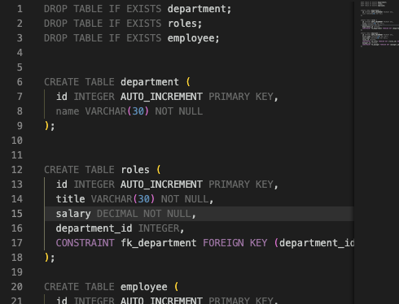
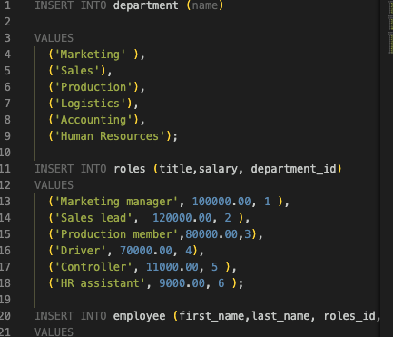
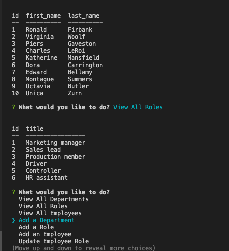

# Employee-Tracker
User can manage employee database by command line.

### Github: https://github.com/fumixer/Employee-Tracker

### Walkthrough video: 

## Usage
User can view all the department, employee and roles.

## Screenshots

## Technologies
* node.js
* npm
* inquire
* mysql2
* console.table

